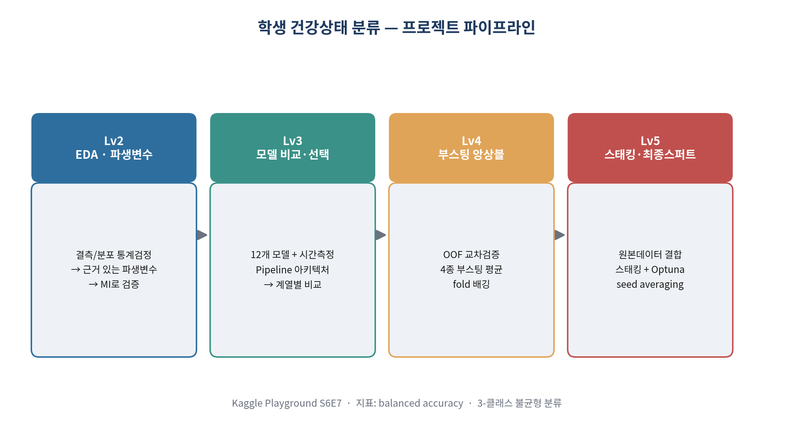
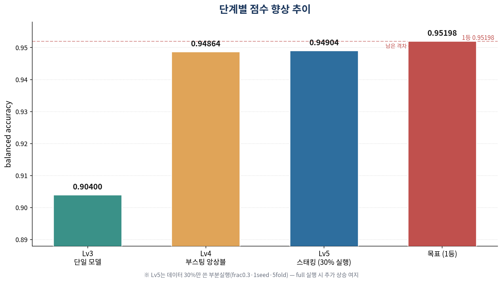

# 🩺 학생 건강상태 분류 (Kaggle Playground S6E7)

생활습관 데이터로 학생의 건강상태(`fit` / `at-risk` / `unhealthy`)를 예측하는 **3-클래스 불균형 분류** 프로젝트입니다.
EDA부터 파생변수 설계, 12개 모델 비교, 부스팅 앙상블, 스태킹까지 **캐글 상위권의 표준 파이프라인**을 단계별로 정리했습니다.

- **대회**: [Kaggle Playground Series S6E7 — Predicting Student Health Risk](https://www.kaggle.com/competitions/playground-series-s6e7)
- **평가지표**: `balanced accuracy` (세 클래스 recall의 평균 — 불균형 데이터라 정확도(accuracy)는 무의미)
- **현재 점수**: **0.94904** (Lv5 스태킹 앙상블, 데이터 30% 부분실행) · 1등 0.95198 추격 중



---

## 📈 성과 요약



| 단계 | 방법 | balanced accuracy |
|---|---|---|
| Lv3 | 단일 부스팅 모델 | ~0.904 |
| Lv4 | 4종 부스팅 앙상블 | 0.94864 |
| **Lv5** | **스태킹 앙상블 (30% 부분실행)** | **0.94904** ← 현재 최고 |
| 목표 | 1등 | 0.95198 |

> 단일 모델 → 앙상블에서 큰 폭(+0.045) 상승, 스태킹으로 한 번 더 갱신. 현재 제출 파일은 `submission_lv5_frac0.3_1seed_5fold.csv`(데이터 30%만 사용)입니다.
> **아직 부분실행 상태** — Lv5를 full(frac1.0)·멀티seed·10-fold로 돌리면 남은 격차(+0.0029)를 더 좁힐 여지가 큽니다.

---

## 📂 폴더 구조

```
student-health-classification/
├── README.md                        ← 지금 이 파일 (프로젝트 전체 소개)
├── requirements.txt                 ← 필요한 파이썬 패키지
├── .gitignore
├── notebooks/                       ← 실제 코드 (Colab/Jupyter 노트북)
│   ├── 01_EDA_및_파생변수설계.ipynb
│   ├── 02_모델비교_및_모델선택.ipynb
│   ├── 03_부스팅_앙상블.ipynb
│   └── 04_스태킹_최종스퍼트.ipynb
├── docs/                            ← 각 노트북이 "뭘 한 건지" 쉬운 설명
│   ├── 01_EDA_설명.md
│   ├── 02_모델링_설명.md
│   ├── 03_앙상블_설명.md
│   ├── 04_스태킹_설명.md
│   └── 용어사전.md                  ← ML 초보용 용어 정리
└── assets/                          ← 시각화 이미지
    ├── 아키텍처_파이프라인.png
    ├── 점수_향상_추이.png
    └── 결과이미지_안내.md            ← 노트북 실행 시 생기는 그래프 안내
```

---

## 🗺️ 단계별 한눈에 보기

각 단계가 **무엇을, 왜** 했는지 한 줄 요약입니다. 자세한 설명은 `docs/` 폴더에 있어요.

### 1️⃣ `01_EDA_및_파생변수설계` — 데이터 이해 & 재료 만들기
데이터를 통계적으로 뜯어보고(결측치·분포·타깃과의 관계), **근거 있는 파생변수**를 만든 뒤 **정말 도움되는지 검증**까지 한 단계.
→ 핵심 산출물: `lifestyle_risk_score`(복합 위험점수), 서열 인코딩(`*_ord`) 등
📄 [자세한 설명](docs/01_EDA_설명.md)

### 2️⃣ `02_모델비교_및_모델선택` — 어떤 모델이 좋은지 찾기
선형/거리/트리/부스팅 **12개 모델을 같은 조건(Pipeline)에서 비교**하고, 학습 시간까지 재서 **성능·안정성·효율** 기준으로 모델을 골랐습니다.
→ 핵심 산출물: 모델 비교표, 시간 대비 성능 산점도
📄 [자세한 설명](docs/02_모델링_설명.md)

### 3️⃣ `03_부스팅_앙상블` — 점수 끌어올리기 (1차)
LightGBM·XGBoost·CatBoost·HistGradientBoosting **4종 부스팅을 OOF 교차검증으로 학습**하고 확률을 평균해 앙상블. 서로의 실수를 상쇄시켜 단일 모델보다 높은 점수를 얻습니다.
→ 핵심 개념: OOF, fold 배깅, early stopping
📄 [자세한 설명](docs/03_앙상블_설명.md)

### 4️⃣ `04_스태킹_최종스퍼트` — 점수 끌어올리기 (2차, 최종)
원본 데이터 결합, **스태킹(메타모델)**, Optuna 튜닝, seed averaging, 클래스별 확률 보정까지. 작은 이득을 여러 개 쌓아 1등을 추격하는 마무리 단계. **OOF 캐싱**으로 재실험이 빠릅니다.
→ 핵심 개념: 스태킹, 원본 데이터 증강, 확률 보정
📄 [자세한 설명](docs/04_스태킹_설명.md)

---

## ▶️ 실행 방법

이 노트북들은 **Google Colab** 기준으로 작성됐습니다.

1. Colab에서 노트북을 열고, 상단 `DATA_PATH`를 본인의 데이터 위치로 수정합니다.
2. Lv4·Lv5는 **런타임 → 런타임 유형 변경 → T4 GPU**를 켜면 훨씬 빠릅니다.
3. 순서대로(01 → 04) 실행하면 됩니다. Lv3·Lv4·Lv5는 각각 **단독 실행 가능**하도록 데이터 로드·파생변수 코드를 포함하고 있습니다.

```bash
pip install -r requirements.txt
```

---

## 🧠 이 프로젝트에서 배운 핵심

- **불균형 분류에서 accuracy는 함정** → `balanced accuracy`로 평가하고 `class_weight='balanced'`로 대응
- **파생변수는 "느낌"이 아니라 검증(MI·리프트 테스트)으로** 채택/기각
- **좋은 모델 = 오래 학습이 아니라** 올바른 지표 + 정직한 검증(OOF) + 맞는 모델 계열
- **앙상블·스태킹**은 서로 다르게 틀리는 모델을 합쳐 분산을 줄이는 기법

---

## 📝 솔직한 기록

이 프로젝트는 **머신러닝을 막 시작한 시점에 생성형 AI의 도움을 받아** 진행했습니다.
그래서 각 노트북에 "무엇을·왜" 했는지 주석을 최대한 남겼고, `docs/`에 제 언어로 다시 정리하며 복습했습니다.
코드를 그대로 베끼기보다 **각 단계의 의도를 이해하는 것**에 집중했습니다.

> 서비스 기획(SCQA)까지 포함: "생활습관 기반 건강 위험군 조기경보 → 맞춤 코칭 추천" — 자세한 내용은 Lv3/Lv4 노트북 마지막 참고.
